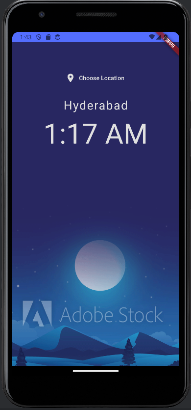
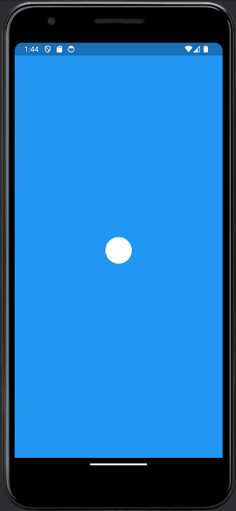
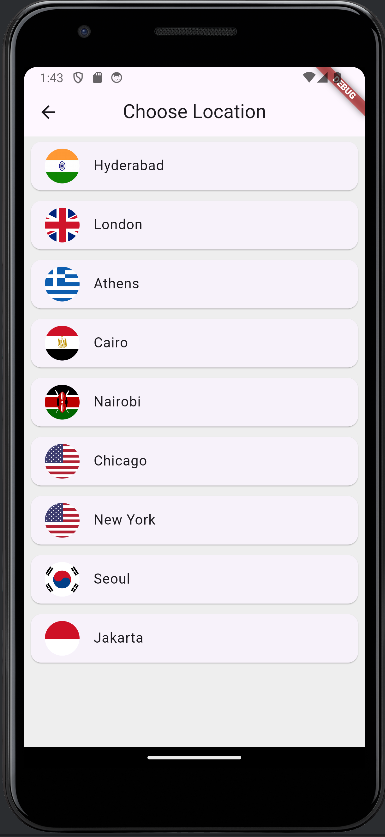

# World Time App

A simple Flutter application that allows users to check the current time in different locations worldwide. The app fetches time data from the World Time API and displays it in an intuitive and visually appealing way, with dynamic background changes based on day or night.

## Features
- View the current time for various world locations.
- Choose a location from a list to see the time in that region.
- Dynamic background images that change based on whether it's day or night in the selected location.
- Simple, clean, and responsive UI with smooth navigation between screens.

## Screens

1. **Loading Screen**  
   Displays a loading animation while fetching data from the API.

2. **Home Screen**  
   Displays the current time for the chosen location along with an appropriate background (day or night).

3. **Choose Location Screen**  
   Allows users to select a new location from a list of predefined options.

## Project Structure

- **`main.dart`**: Entry point for the app, responsible for routing and initializing the app.
- **`home.dart`**: Displays the current time for the chosen location with a background indicating day or night.
- **`loading.dart`**: Loading screen with a spinner while data is being fetched from the World Time API.
- **`chooseLocation.dart`**: Allows users to select a location from a list to view the time for that location.
- **`worldtime.dart`**: Service that handles the HTTP request to fetch time data and processes the response.

## How It Works

1. **API Integration**  
   The app uses the [World Time API](http://worldtimeapi.org/) to fetch real-time data about different time zones. Each location is identified by a specific endpoint in the API.
   
2. **Day/Night Indicator**  
   The app checks whether it's daytime or nighttime at the selected location and updates the background image accordingly.
   
3. **Navigation**  
   The app supports simple navigation between the loading screen, home screen, and location selection screen using Flutter’s `Navigator` class.

## Getting Started

### Prerequisites

- [Flutter SDK](https://flutter.dev/docs/get-started/install)
- [Dart SDK](https://dart.dev/get-dart)
- Any text editor such as [VS Code](https://code.visualstudio.com/) or [Android Studio](https://developer.android.com/studio).

### Installation

1. **Clone the repository:**
   ```bash
   git clone https://github.com/yourusername/world_time.git

2. **Navigate to the project directory:**
   ```bash
   cd world_time

3. **Install the required dependencies:**
   ```bash
   flutter pub get

4. **Run the app on an emulator or a connected device:**
   ```bash
   flutter run

5. **Run the app on an emulator or a connected device:**
   ```bash
    flutter pub add http
    flutter pub add intl
    flutter pub add flutter_spinkit

### Dependencies

The project uses the following external packages:

- **http**: For making HTTP requests to the World Time API.
- **intl**: For formatting the time in a readable format.
- **flutter_spinkit**: For displaying a loading animation.


## Screenshots of App




